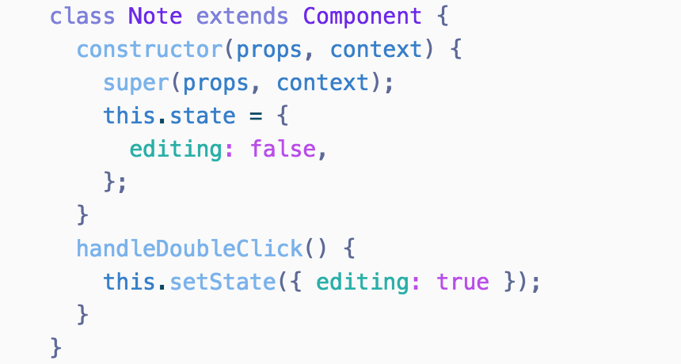

## Ariake Light Syntax theme

## This theme is a 🍴 fork of [Ariake Dark Syntax theme](https://github.com/pathtrk/ariake-dark-syntax).

Ariake is an atom syntax theme inspired by Japanese traditional colors and the poetry composed 1000 years ago.

"有明の　つれなく見えし　別れより　暁ばかり　憂きものはなし" - Mibu no Tadamine (壬生忠岑)
> "Since I saw the moon in dawn when you said good-bye, My heart aches every time I see it again."

This theme is also a fork of [One Dark Syntax](https://github.com/atom/one-dark-syntax).

> The font used in the screenshot is [Fira Mono](https://github.com/mozilla/Fira).

There is also a matching [UI theme](https://atom.io/themes/one-dark-ui).

### Install

## ⚠️ This is WIP
`Will publish to https://atom.io/packages soon`

## LICENSE
[MIT](./LICENSE)
